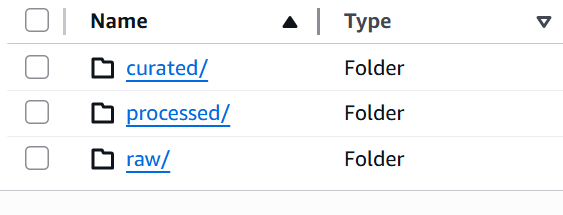
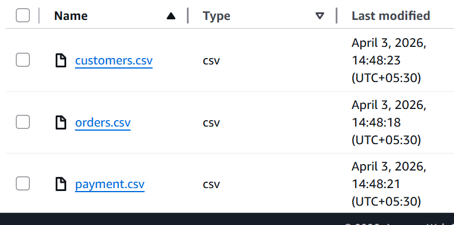
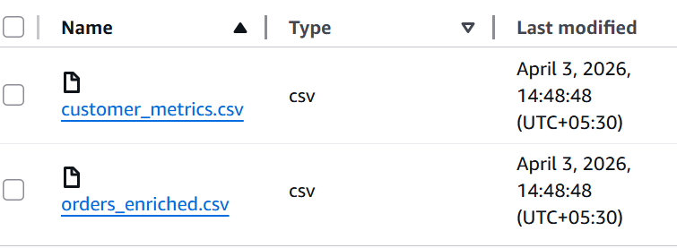
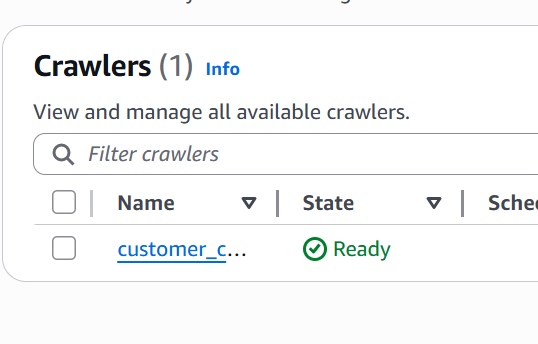
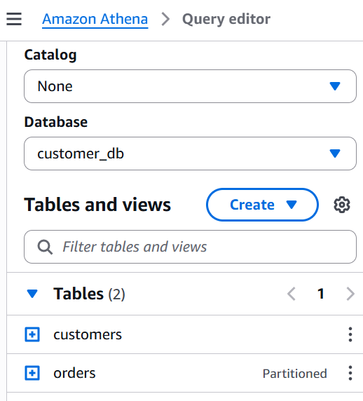

# AWS Customer Behavior Analytics Pipeline

> End-to-end cloud-based analytics pipeline to uncover customer retention, revenue concentration, and operational inefficiencies in an e-commerce dataset.

---

## 🔹 Problem Statement

The business lacked visibility into customer behavior and revenue drivers, resulting in:

- Critically low retention (3%)
- Revenue concentrated among a small subset of customers
- High delivery delays (12 days average)
- No unified analytics system for decision-making

---

## 🔹 Solution Overview

Built a **scalable AWS-based data pipeline** to transform raw transactional data into structured insights for business decision-making.

**Pipeline Flow:**

Raw Data → Python (Cleaning & Feature Engineering) → S3 (Data Lake) → Glue (Catalog) → Athena (SQL) → Tableau (Dashboard)

---

## 🔹 Key Outcomes (What This Project Proves)

- Designed a **data lake architecture on AWS**
- Performed **end-to-end analytical workflow (data → insight → decision)**
- Identified **2x revenue opportunity from repeat customers**
- Diagnosed **retention as the primary business bottleneck**
- Evaluated **operational inefficiencies vs actual business impact**

---

## 🔹 Architecture

---

## 🔹 AWS Pipeline Execution (Proof of Work)

### 📦 S3 Data Lake

- Implemented layered storage: **raw → processed**
- Enabled scalable and cost-efficient data access

---

###  Raw Data Ingestion

- Uploaded structured e-commerce datasets into S3

---

###  Data Processing (Python)

- Cleaned missing values, standardized schema
- Performed feature engineering for analysis readiness

---

###  AWS Glue Data Catalog

- Automated schema detection using Glue Crawler
- Created metadata layer for Athena querying

---

###  Amazon Athena (SQL Engine)

- Executed analytical queries directly on S3
- No infrastructure setup required (serverless)

---

## 🔹 Analytical Breakdown

### 1. Customer Segmentation
- Identified high-value vs low-value users
- Analyzed purchase frequency and spending behavior

### 2. Revenue Analysis
- Evaluated revenue distribution across customers
- Detected heavy dependency on top contributors

### 3. Retention Analysis
- Compared repeat vs one-time customers
- Quantified retention rate (~3%)

### 4. Delivery Performance
- Measured delivery delays (~12 days avg)
- Assessed impact on customer retention

📁 SQL Queries: `/sql/`

---

## 🔹 Key Insights

- 🔻 Retention is critically low (~3%), limiting long-term growth  
- 💰 Repeat customers generate ~2x higher revenue than one-time users  
- 🚚 Average delivery delay ≈ 12 days  
- 📉 Delivery delays have weak correlation with retention  
- ⚠️ Revenue is concentrated among a small segment of customers  

---

## 🔹 Business Implications

| Observation | Insight | Action |
|------------|--------|--------|
| Low retention | Growth bottleneck | Invest in retention strategies (loyalty, re-engagement) |
| High-value customers | Disproportionate revenue impact | Target and retain top users |
| Delivery delays | Not primary churn driver | Optimize selectively |
| Revenue concentration | High risk exposure | Diversify customer base |

---

## 🔹 Dashboard

---

## 🔹 Tech Stack

**AWS S3 • AWS Glue • Amazon Athena • Python • SQL • Tableau**

---

## 🔹 Project Structure

---

---

## 🔹 Future Enhancements

- Churn prediction model (ML)
- Cohort and LTV analysis
- Automated pipeline (AWS Lambda / Airflow)
- Real-time data ingestion

---

## 🔹 Key Takeaway

This project demonstrates the ability to:

- Build scalable data pipelines on AWS  
- Perform structured business analysis using SQL  
- Translate data into actionable insights  
- Prioritize decisions based on measurable impact  

---
