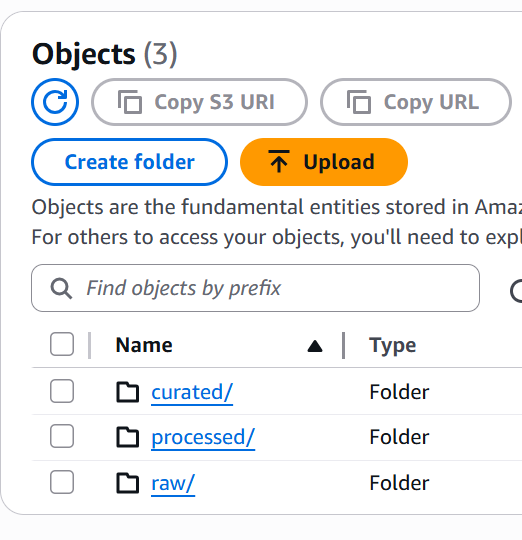
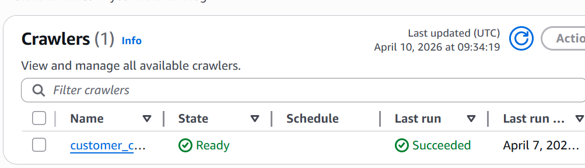
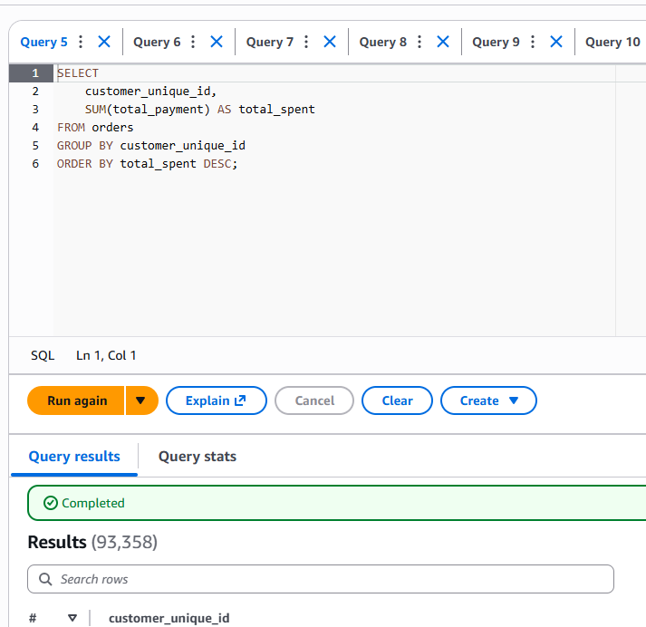

# AWS Customer Behavior Analytics Pipeline

---

## 🚨 Business Problem

An e-commerce platform is facing:

- Extremely low customer retention (~3%)
- Revenue concentrated among a small group of users
- Lack of visibility into customer purchasing behavior

This creates dependency risk and limits long-term revenue growth.

---

## 💡 Solution

Built a scalable AWS-based analytics pipeline to process customer transaction data and generate actionable business insights.

The system transforms raw data into structured insights to support decision-making around customer retention and revenue optimization.

---

## 🏗️ Architecture


---

## ⚙️ Pipeline Flow

Raw Data → S3 (Data Lake) → AWS Glue (ETL & Catalog) → Athena (SQL Analysis) → Dashboard (Visualization)

---

## 🛠️ Tech Stack

- AWS S3 (Data Storage)
- AWS Glue (ETL + Data Catalog)
- Amazon Athena (Serverless SQL)
- SQL
- Python (Data Cleaning & Preprocessing)
- Tableau (Visualization)

---

## ⚙️ Data Engineering Considerations

- Implemented layered data architecture (raw → processed → curated)
- Applied partitioning on order data to optimize Athena query performance
- Used AWS Glue for schema inference and catalog management
- Leveraged Athena for cost-efficient, serverless querying

---

## 📊 Key Insights

- Repeat customers spend ~2x more than one-time users
- Customer retention is critically low (~3%)
- Revenue is heavily concentrated among a small segment of users
- Delivery delays have limited impact on customer retention

---

## 📌 Business Recommendations

- Focus on retention strategies (highest ROI opportunity)
- Target high-value repeat customers
- Introduce loyalty programs to improve repeat purchase rate
- Reduce dependency on one-time buyers

---

## 🎯 Why This Project Matters

This project demonstrates how raw transactional data can be transformed into actionable business insights using a scalable, cloud-based data pipeline.

---

## 📸 Implementation Proof

### S3 Data Lake Structure


### Glue Data Catalog


### Athena Query Execution


---

## 📁 Project Structure
```
customer-behavior-analytics-aws/
│
├── data/
│ ├── raw/
│ ├── processed/
│ ├── curated/
│
├── notebooks/
│ ├── customer_data_preprocessing_eda.ipynb
│
├── sql/
│ ├── customer_segmentation.sql
│ ├── revenue_analysis.sql
│ ├── retention_analysis.sql
│ ├── top_customers.sql
│
├── architecture/
│ ├── architecture.png
│ ├── s3_data_lake_structure.png
│ ├── glue_catalog.png
│ ├── athena_query_execution.png
│
├── dashboard/
│ ├── dashboard.png
│
├── README.md

```
---

## 🚀 Future Improvements

- Real-time data processing using AWS Kinesis
- Churn prediction using machine learning
- Automated ETL workflows and scheduling

---

## 📌 Author

Sujal Gupta
